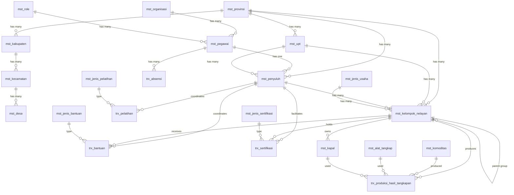

# Database Restructure - Design Document

## 1. Overview

This design document outlines the comprehensive restructuring of the fisheries management system database. The restructure involves:

1. **Renaming 11 existing tables** to follow a consistent naming convention (mst_* for master data, trx_* for transactions)
2. **Adding new columns** to 4 existing tables (pegawai, penyuluh, kelompok_nelayan, absensi)
3. **Creating 11 new tables** (7 master tables, 4 transaction tables) for fisheries operations
4. **Preserving all existing data** with special emphasis on master wilayah and pegawai data
5. **Maintaining API compatibility** with existing endpoints and response formats

The design prioritizes data integrity and zero data loss during migration, with comprehensive verification steps.

## 2. Architecture

### 2.1 Database Layer Architecture

```
┌─────────────────────────────────────────────────────────────┐
│                     Application Layer                        │
│  (Handlers → Repositories → Drizzle ORM → PostgreSQL)       │
└─────────────────────────────────────────────────────────────┘
                              │
                              ▼
┌─────────────────────────────────────────────────────────────┐
│                    Master Data Tables                        │
│  ┌──────────────┐  ┌──────────────┐  ┌──────────────┐      │
│  │ mst_provinsi │  │ mst_kabupaten│  │ mst_kecamatan│      │
│  └──────────────┘  └──────────────┘  └──────────────┘      │
│  ┌──────────────┐  ┌──────────────┐  ┌──────────────┐      │
│  │  mst_desa    │  │  mst_upt     │  │ mst_organisasi│     │
│  └──────────────┘  └──────────────┘  └──────────────┘      │
│  ┌──────────────┐  ┌──────────────┐  ┌──────────────┐      │
│  │  mst_role    │  │ mst_pegawai  │  │ mst_penyuluh │      │
│  └──────────────┘  └──────────────┘  └──────────────┘      │
│  ┌──────────────┐  ┌──────────────┐  ┌──────────────┐      │
│  │mst_kelompok_ │  │mst_jenis_    │  │ mst_komoditas│      │
│  │   nelayan    │  │   usaha      │  │              │      │
│  └──────────────┘  └──────────────┘  └──────────────┘      │
│  ┌──────────────┐  ┌──────────────┐  ┌──────────────┐      │
│  │mst_alat_     │  │  mst_kapal   │  │mst_jenis_    │      │
│  │  tangkap     │  │              │  │  bantuan     │      │
│  └──────────────┘  └──────────────┘  └──────────────┘      │
│  ┌──────────────┐  ┌──────────────┐                        │
│  │mst_jenis_    │  │mst_jenis_    │                        │
│  │  pelatihan   │  │ sertifikasi  │                        │
│  └──────────────┘  └──────────────┘                        │
└─────────────────────────────────────────────────────────────┘
                              │
                              ▼
┌─────────────────────────────────────────────────────────────┐
│                  Transaction Data Tables                     │
│  ┌──────────────┐  ┌──────────────┐  ┌──────────────┐      │
│  │trx_absensi   │  │trx_produksi_ │  │ trx_bantuan  │      │
│  │              │  │hasil_tangkapan│  │              │      │
│  └──────────────┘  └──────────────┘  └──────────────┘      │
│  ┌──────────────┐  ┌──────────────┐                        │
│  │trx_pelatihan │  │trx_sertifikasi│                       │
│  └──────────────┘  └──────────────┘                        │
└─────────────────────────────────────────────────────────────┘
```

### 2.2 Migration Strategy Overview

The migration follows a **phased approach** to ensure data integrity:

**Phase 1: Pre-Migration Verification**
- Create full database backup
- Record row counts for all tables
- Verify foreign key relationships
- Document current schema state

**Phase 2: Schema Migration**
- Rename existing tables (with CASCADE for foreign keys)
- Add new columns to renamed tables
- Create new tables with proper constraints
- Recreate indexes

**Phase 3: Post-Migration Verification**
- Verify row counts match pre-migration counts
- Verify foreign key relationships intact
- Verify indexes recreated
- Test sample queries

**Phase 4: Application Layer Updates**
- Update schema files
- Update repositories
- Update handlers
- Update types
- Update routes

**Phase 5: Testing & Validation**
- Run all API endpoint tests
- Verify pagination and search
- Verify CRUD operations
- Performance testing


## 3. Components and Interfaces

### 3.1 Renamed Tables (11 tables)

#### 3.1.1 mst_provinsi (formerly provinces)

**Purpose**: Store Indonesian province master data

**Schema**:
```typescript
{
  id: integer (PRIMARY KEY),
  name: text (NOT NULL),
  alt_name: text,
  latitude: numeric,
  longitude: numeric
}
```

**Indexes**:
- PRIMARY KEY on id
- INDEX idx_mst_provinsi_name_lower on name

**Migration Notes**:
- CRITICAL: Must preserve all 34 provinces
- Verify count: SELECT COUNT(*) FROM provinces = 34
- No data transformation needed

---

#### 3.1.2 mst_kabupaten (formerly regencies)

**Purpose**: Store Indonesian regency/city master data

**Schema**:
```typescript
{
  id: bigint (PRIMARY KEY),
  province_id: bigint (NOT NULL, FOREIGN KEY → mst_provinsi.id),
  name: text (NOT NULL),
  alt_name: text (NOT NULL, DEFAULT ''),
  latitude: numeric (NOT NULL, DEFAULT '0'),
  longitude: numeric (NOT NULL, DEFAULT '0')
}
```

**Indexes**:
- PRIMARY KEY on id
- INDEX idx_mst_kabupaten_province_id on province_id
- INDEX idx_mst_kabupaten_name_lower on name
- INDEX idx_mst_kabupaten_province_name on (province_id, name)

**Foreign Keys**:
- province_id → mst_provinsi.id (ON DELETE CASCADE, ON UPDATE CASCADE)

**Migration Notes**:
- CRITICAL: Must preserve all ~514 regencies
- Verify count: SELECT COUNT(*) FROM regencies = 514
- Verify foreign keys: All province_id must exist in mst_provinsi

---

#### 3.1.3 mst_kecamatan (formerly districts)

**Purpose**: Store Indonesian district master data

**Schema**:
```typescript
{
  id: bigint (PRIMARY KEY),
  regency_id: bigint (NOT NULL, FOREIGN KEY → mst_kabupaten.id),
  name: text (NOT NULL),
  alt_name: text (NOT NULL, DEFAULT ''),
  latitude: numeric (NOT NULL, DEFAULT '0'),
  longitude: numeric (NOT NULL, DEFAULT '0')
}
```

**Indexes**:
- PRIMARY KEY on id
- INDEX idx_mst_kecamatan_regency_id on regency_id
- INDEX idx_mst_kecamatan_name_lower on name
- INDEX idx_mst_kecamatan_regency_name on (regency_id, name)

**Foreign Keys**:
- regency_id → mst_kabupaten.id (ON DELETE CASCADE, ON UPDATE CASCADE)

**Migration Notes**:
- CRITICAL: Must preserve all ~7000+ districts
- Verify count matches pre-migration
- Verify foreign keys: All regency_id must exist in mst_kabupaten

---

#### 3.1.4 mst_desa (formerly villages)

**Purpose**: Store Indonesian village master data

**Schema**:
```typescript
{
  id: bigint (PRIMARY KEY),
  district_id: bigint (NOT NULL, FOREIGN KEY → mst_kecamatan.id),
  name: text (NOT NULL),
  alt_name: text (NOT NULL, DEFAULT ''),
  latitude: double precision (NOT NULL, DEFAULT 0),
  longitude: double precision (NOT NULL, DEFAULT 0)
}
```

**Indexes**:
- PRIMARY KEY on id
- INDEX idx_mst_desa_district_id on district_id
- INDEX idx_mst_desa_name_lower on name
- INDEX idx_mst_desa_district_name on (district_id, name)

**Foreign Keys**:
- district_id → mst_kecamatan.id (ON DELETE CASCADE, ON UPDATE CASCADE)

**Migration Notes**:
- CRITICAL: Must preserve all ~80000+ villages
- Verify count matches pre-migration
- Verify foreign keys: All district_id must exist in mst_kecamatan


---

#### 3.1.5 mst_upt (formerly unit_pelaksanaan_teknis)

**Purpose**: Store technical implementation unit data

**Schema**:
```typescript
{
  id: serial (PRIMARY KEY),
  nama_organisasi: varchar(255) (NOT NULL),
  pimpinan: varchar(255) (NOT NULL),
  province_id: integer (NOT NULL, FOREIGN KEY → mst_provinsi.id)
}
```

**Foreign Keys**:
- province_id → mst_provinsi.id

**Migration Notes**:
- Preserve all existing UPT records
- Update foreign key reference to mst_provinsi

---

#### 3.1.6 mst_organisasi (formerly organisasi)

**Purpose**: Store organization hierarchy data

**Schema**:
```typescript
{
  id: serial (PRIMARY KEY),
  level_organisasi: varchar(100) (NOT NULL),
  kode_organisasi: varchar(50) (NOT NULL),
  nama_organisasi: varchar(255) (NOT NULL),
  keterangan: text,
  created_at: timestamp (DEFAULT NOW()),
  updated_at: timestamp (DEFAULT NOW())
}
```

**Migration Notes**:
- Preserve all existing organization records
- No schema changes, only table rename

---

#### 3.1.7 mst_role (formerly roles)

**Purpose**: Store user role definitions

**Schema**:
```typescript
{
  id: serial (PRIMARY KEY),
  level_role: varchar(100) (NOT NULL),
  nama_role: varchar(255) (NOT NULL),
  keterangan: text,
  created_at: timestamp (DEFAULT NOW()),
  updated_at: timestamp (DEFAULT NOW())
}
```

**Migration Notes**:
- Preserve all existing role records
- No schema changes, only table rename

---

#### 3.1.8 mst_pegawai (formerly pegawai)

**Purpose**: Store employee/staff data with enhanced fields

**Schema**:
```typescript
{
  id: serial (PRIMARY KEY),
  nip: varchar(50) (NOT NULL, UNIQUE),
  nama: varchar(255) (NOT NULL),
  email: varchar(255) (NOT NULL, UNIQUE),
  jabatan: varchar(255) (NOT NULL),
  organisasi_id: integer (NOT NULL, FOREIGN KEY → mst_organisasi.id),
  role_id: integer (NOT NULL, FOREIGN KEY → mst_role.id),
  status_aktif: boolean (NOT NULL, DEFAULT true),
  last_login: timestamp,
  
  // NEW COLUMNS
  no_hp: varchar(20),
  alamat: text,
  foto_url: varchar(500),
  tanggal_lahir: date,
  jenis_kelamin: varchar(1), // 'L' or 'P'
  pendidikan_terakhir: varchar(100),
  tanggal_bergabung: date,
  
  created_at: timestamp (DEFAULT NOW()),
  updated_at: timestamp (DEFAULT NOW())
}
```

**Foreign Keys**:
- organisasi_id → mst_organisasi.id
- role_id → mst_role.id

**Migration Notes**:
- CRITICAL: Preserve all existing pegawai records
- Add new columns with NULL allowed (no default values)
- Verify NIP uniqueness maintained
- Verify email uniqueness maintained
- Update foreign key references to mst_organisasi and mst_role


---

#### 3.1.9 mst_penyuluh (formerly penyuluh)

**Purpose**: Store extension officer data with enhanced fields

**Schema**:
```typescript
{
  id: serial (PRIMARY KEY),
  pegawai_id: integer (NOT NULL, FOREIGN KEY → mst_pegawai.id),
  upt_id: integer (NOT NULL, FOREIGN KEY → mst_upt.id),
  province_id: integer (NOT NULL, FOREIGN KEY → mst_provinsi.id),
  jumlah_kelompok: integer (NOT NULL, DEFAULT 0),
  program_prioritas: varchar(255),
  status_aktif: boolean (NOT NULL, DEFAULT true),
  
  // NEW COLUMNS
  wilayah_binaan: text, // JSON array of district/village IDs
  spesialisasi: varchar(255), // e.g., "Budidaya", "Tangkap", "Pengolahan"
  
  created_at: timestamp (DEFAULT NOW()),
  updated_at: timestamp (DEFAULT NOW())
}
```

**Foreign Keys**:
- pegawai_id → mst_pegawai.id
- upt_id → mst_upt.id
- province_id → mst_provinsi.id

**Migration Notes**:
- Preserve all existing penyuluh records
- Add new columns with NULL allowed
- Update foreign key references to renamed tables

---

#### 3.1.10 mst_kelompok_nelayan (formerly kelompok_nelayan)

**Purpose**: Store fisherman group data with enhanced fields

**Schema**:
```typescript
{
  id: serial (PRIMARY KEY),
  nib_kelompok: varchar(50) (NOT NULL, UNIQUE),
  no_registrasi: varchar(50) (NOT NULL, UNIQUE),
  nama_kelompok: varchar(255) (NOT NULL),
  nik_ketua: varchar(50) (NOT NULL),
  nama_ketua: varchar(255) (NOT NULL),
  upt_id: integer (NOT NULL, FOREIGN KEY → mst_upt.id),
  province_id: integer (NOT NULL, FOREIGN KEY → mst_provinsi.id),
  penyuluh_id: integer (NOT NULL, FOREIGN KEY → mst_penyuluh.id),
  gabungan_kelompok_id: integer (FOREIGN KEY → mst_kelompok_nelayan.id),
  jumlah_anggota: integer (NOT NULL, DEFAULT 1),
  
  // NEW COLUMNS
  jenis_usaha_id: integer (FOREIGN KEY → mst_jenis_usaha.id),
  alamat: text,
  no_hp_ketua: varchar(20),
  tahun_berdiri: integer,
  status_kelompok: varchar(50), // 'Aktif', 'Tidak Aktif', 'Pembinaan'
  luas_lahan: decimal(10,2), // in hectares
  koordinat_latitude: decimal(10,8),
  koordinat_longitude: decimal(11,8),
  
  created_at: timestamp (DEFAULT NOW()),
  updated_at: timestamp (DEFAULT NOW())
}
```

**Foreign Keys**:
- upt_id → mst_upt.id
- province_id → mst_provinsi.id
- penyuluh_id → mst_penyuluh.id
- gabungan_kelompok_id → mst_kelompok_nelayan.id (self-reference)
- jenis_usaha_id → mst_jenis_usaha.id (NEW)

**Migration Notes**:
- Preserve all existing kelompok_nelayan records
- Add new columns with NULL allowed
- jenis_usaha_id will be NULL initially (can be updated later)
- Update foreign key references to renamed tables

---

#### 3.1.11 trx_absensi (formerly absensi)

**Purpose**: Store attendance transaction data with enhanced fields

**Schema**:
```typescript
{
  id: serial (PRIMARY KEY),
  date: date (NOT NULL),
  nip: varchar(50) (NOT NULL, FOREIGN KEY → mst_pegawai.nip),
  checkin: timestamp (NOT NULL),
  ci_latitude: decimal(10,8) (NOT NULL),
  ci_longitude: decimal(11,8) (NOT NULL),
  checkin_photo_url: varchar(500),
  checkin_photo_id: varchar(255),
  checkout: timestamp,
  co_latitude: decimal(10,8),
  co_longitude: decimal(11,8),
  working_hours: decimal(5,2),
  status: varchar(50),
  total_overtime: decimal(5,2) (DEFAULT 0),
  
  // NEW COLUMNS
  keterangan: text,
  foto_checkout_url: varchar(500),
  foto_checkout_id: varchar(255),
  
  created_at: timestamp (DEFAULT NOW()),
  updated_at: timestamp (DEFAULT NOW())
}
```

**Foreign Keys**:
- nip → mst_pegawai.nip

**Migration Notes**:
- Preserve all existing absensi records
- Add new columns with NULL allowed
- Update foreign key reference to mst_pegawai


### 3.2 New Master Tables (7 tables)

#### 3.2.1 mst_jenis_usaha

**Purpose**: Store types of fisheries business (capture, aquaculture, processing, etc.)

**Schema**:
```typescript
{
  id: serial (PRIMARY KEY),
  kode_jenis_usaha: varchar(20) (NOT NULL, UNIQUE),
  nama_jenis_usaha: varchar(255) (NOT NULL),
  kategori: varchar(100) (NOT NULL), // 'Tangkap', 'Budidaya', 'Pengolahan', 'Pemasaran'
  keterangan: text,
  status_aktif: boolean (NOT NULL, DEFAULT true),
  created_at: timestamp (DEFAULT NOW()),
  updated_at: timestamp (DEFAULT NOW())
}
```

**Indexes**:
- PRIMARY KEY on id
- UNIQUE INDEX on kode_jenis_usaha
- INDEX on kategori for filtering

**Sample Data**:
- JU001 | Penangkapan Ikan Laut | Tangkap
- JU002 | Budidaya Ikan Air Tawar | Budidaya
- JU003 | Pengolahan Ikan | Pengolahan
- JU004 | Budidaya Rumput Laut | Budidaya

---

#### 3.2.2 mst_komoditas

**Purpose**: Store fisheries commodity types (fish species, seaweed, etc.)

**Schema**:
```typescript
{
  id: serial (PRIMARY KEY),
  kode_komoditas: varchar(20) (NOT NULL, UNIQUE),
  nama_komoditas: varchar(255) (NOT NULL),
  nama_ilmiah: varchar(255), // Scientific name
  kategori: varchar(100) (NOT NULL), // 'Ikan', 'Udang', 'Rumput Laut', 'Kerang', etc.
  satuan: varchar(50) (NOT NULL), // 'kg', 'ton', 'ekor'
  harga_pasar_rata: decimal(15,2), // Average market price
  keterangan: text,
  status_aktif: boolean (NOT NULL, DEFAULT true),
  created_at: timestamp (DEFAULT NOW()),
  updated_at: timestamp (DEFAULT NOW())
}
```

**Indexes**:
- PRIMARY KEY on id
- UNIQUE INDEX on kode_komoditas
- INDEX on kategori for filtering
- INDEX on nama_komoditas for search

**Sample Data**:
- KOM001 | Ikan Tuna | Thunnus | Ikan | kg
- KOM002 | Udang Vaname | Litopenaeus vannamei | Udang | kg
- KOM003 | Rumput Laut | Eucheuma cottonii | Rumput Laut | kg

---

#### 3.2.3 mst_alat_tangkap

**Purpose**: Store fishing gear/equipment types

**Schema**:
```typescript
{
  id: serial (PRIMARY KEY),
  kode_alat_tangkap: varchar(20) (NOT NULL, UNIQUE),
  nama_alat_tangkap: varchar(255) (NOT NULL),
  jenis: varchar(100) (NOT NULL), // 'Jaring', 'Pancing', 'Perangkap', 'Lainnya'
  target_komoditas: text, // JSON array of commodity IDs
  keterangan: text,
  status_aktif: boolean (NOT NULL, DEFAULT true),
  created_at: timestamp (DEFAULT NOW()),
  updated_at: timestamp (DEFAULT NOW())
}
```

**Indexes**:
- PRIMARY KEY on id
- UNIQUE INDEX on kode_alat_tangkap
- INDEX on jenis for filtering

**Sample Data**:
- AT001 | Jaring Insang | Jaring
- AT002 | Pancing Tonda | Pancing
- AT003 | Bubu | Perangkap

---

#### 3.2.4 mst_kapal

**Purpose**: Store fishing vessel master data

**Schema**:
```typescript
{
  id: serial (PRIMARY KEY),
  kelompok_nelayan_id: integer (NOT NULL, FOREIGN KEY → mst_kelompok_nelayan.id),
  no_registrasi_kapal: varchar(50) (NOT NULL, UNIQUE),
  nama_kapal: varchar(255) (NOT NULL),
  jenis_kapal: varchar(100) (NOT NULL), // 'Motor', 'Perahu', 'Kapal Besar'
  ukuran_gt: decimal(10,2), // Gross Tonnage
  ukuran_panjang: decimal(10,2), // meters
  ukuran_lebar: decimal(10,2), // meters
  mesin_pk: decimal(10,2), // Horse Power
  tahun_pembuatan: integer,
  pelabuhan_pangkalan: varchar(255),
  status_kapal: varchar(50) (NOT NULL, DEFAULT 'Aktif'), // 'Aktif', 'Tidak Aktif', 'Perbaikan'
  created_at: timestamp (DEFAULT NOW()),
  updated_at: timestamp (DEFAULT NOW())
}
```

**Foreign Keys**:
- kelompok_nelayan_id → mst_kelompok_nelayan.id

**Indexes**:
- PRIMARY KEY on id
- UNIQUE INDEX on no_registrasi_kapal
- INDEX on kelompok_nelayan_id
- INDEX on status_kapal


---

#### 3.2.5 mst_jenis_bantuan

**Purpose**: Store types of assistance/aid programs

**Schema**:
```typescript
{
  id: serial (PRIMARY KEY),
  kode_jenis_bantuan: varchar(20) (NOT NULL, UNIQUE),
  nama_jenis_bantuan: varchar(255) (NOT NULL),
  kategori: varchar(100) (NOT NULL), // 'Alat', 'Modal', 'Benih', 'Pakan', 'Infrastruktur'
  satuan: varchar(50), // 'unit', 'paket', 'rupiah'
  nilai_estimasi: decimal(15,2), // Estimated value in IDR
  keterangan: text,
  status_aktif: boolean (NOT NULL, DEFAULT true),
  created_at: timestamp (DEFAULT NOW()),
  updated_at: timestamp (DEFAULT NOW())
}
```

**Indexes**:
- PRIMARY KEY on id
- UNIQUE INDEX on kode_jenis_bantuan
- INDEX on kategori for filtering

**Sample Data**:
- BT001 | Bantuan Alat Tangkap | Alat | unit
- BT002 | Bantuan Modal Usaha | Modal | rupiah
- BT003 | Bantuan Benih Ikan | Benih | paket

---

#### 3.2.6 mst_jenis_pelatihan

**Purpose**: Store types of training programs

**Schema**:
```typescript
{
  id: serial (PRIMARY KEY),
  kode_jenis_pelatihan: varchar(20) (NOT NULL, UNIQUE),
  nama_jenis_pelatihan: varchar(255) (NOT NULL),
  kategori: varchar(100) (NOT NULL), // 'Teknis', 'Manajemen', 'Pengolahan', 'Pemasaran'
  durasi_hari: integer, // Duration in days
  target_peserta: varchar(100), // 'Nelayan', 'Pembudidaya', 'Pengolah', 'Semua'
  keterangan: text,
  status_aktif: boolean (NOT NULL, DEFAULT true),
  created_at: timestamp (DEFAULT NOW()),
  updated_at: timestamp (DEFAULT NOW())
}
```

**Indexes**:
- PRIMARY KEY on id
- UNIQUE INDEX on kode_jenis_pelatihan
- INDEX on kategori for filtering

**Sample Data**:
- PL001 | Pelatihan Budidaya Ikan Nila | Teknis | 3 | Pembudidaya
- PL002 | Pelatihan Manajemen Kelompok | Manajemen | 2 | Semua
- PL003 | Pelatihan Pengolahan Ikan | Pengolahan | 5 | Pengolah

---

#### 3.2.7 mst_jenis_sertifikasi

**Purpose**: Store types of certifications

**Schema**:
```typescript
{
  id: serial (PRIMARY KEY),
  kode_jenis_sertifikasi: varchar(20) (NOT NULL, UNIQUE),
  nama_jenis_sertifikasi: varchar(255) (NOT NULL),
  kategori: varchar(100) (NOT NULL), // 'Produk', 'Kompetensi', 'Usaha'
  lembaga_penerbit: varchar(255) (NOT NULL), // Issuing authority
  masa_berlaku_tahun: integer, // Validity period in years
  persyaratan: text, // Requirements
  keterangan: text,
  status_aktif: boolean (NOT NULL, DEFAULT true),
  created_at: timestamp (DEFAULT NOW()),
  updated_at: timestamp (DEFAULT NOW())
}
```

**Indexes**:
- PRIMARY KEY on id
- UNIQUE INDEX on kode_jenis_sertifikasi
- INDEX on kategori for filtering

**Sample Data**:
- SR001 | Sertifikat CBIB | Produk | KKP | 2
- SR002 | Sertifikat Kompetensi Nelayan | Kompetensi | BNSP | 3
- SR003 | Sertifikat Halal | Produk | MUI | 2


### 3.3 New Transaction Tables (4 tables)

#### 3.3.1 trx_produksi_hasil_tangkapan

**Purpose**: Store production/catch transaction data

**Schema**:
```typescript
{
  id: serial (PRIMARY KEY),
  kelompok_nelayan_id: integer (NOT NULL, FOREIGN KEY → mst_kelompok_nelayan.id),
  kapal_id: integer (FOREIGN KEY → mst_kapal.id),
  tanggal_produksi: date (NOT NULL),
  komoditas_id: integer (NOT NULL, FOREIGN KEY → mst_komoditas.id),
  alat_tangkap_id: integer (FOREIGN KEY → mst_alat_tangkap.id),
  jumlah_produksi: decimal(15,2) (NOT NULL), // Quantity
  satuan: varchar(50) (NOT NULL), // 'kg', 'ton', 'ekor'
  harga_jual: decimal(15,2), // Selling price per unit
  total_nilai: decimal(15,2), // Total value
  lokasi_penangkapan: varchar(255), // Fishing location
  koordinat_latitude: decimal(10,8),
  koordinat_longitude: decimal(11,8),
  keterangan: text,
  created_at: timestamp (DEFAULT NOW()),
  updated_at: timestamp (DEFAULT NOW())
}
```

**Foreign Keys**:
- kelompok_nelayan_id → mst_kelompok_nelayan.id
- kapal_id → mst_kapal.id
- komoditas_id → mst_komoditas.id
- alat_tangkap_id → mst_alat_tangkap.id

**Indexes**:
- PRIMARY KEY on id
- INDEX on kelompok_nelayan_id
- INDEX on tanggal_produksi for date range queries
- INDEX on komoditas_id for filtering
- COMPOSITE INDEX on (kelompok_nelayan_id, tanggal_produksi) for reporting

---

#### 3.3.2 trx_bantuan

**Purpose**: Store assistance/aid distribution transactions

**Schema**:
```typescript
{
  id: serial (PRIMARY KEY),
  no_bantuan: varchar(50) (NOT NULL, UNIQUE),
  jenis_bantuan_id: integer (NOT NULL, FOREIGN KEY → mst_jenis_bantuan.id),
  kelompok_nelayan_id: integer (NOT NULL, FOREIGN KEY → mst_kelompok_nelayan.id),
  penyuluh_id: integer (NOT NULL, FOREIGN KEY → mst_penyuluh.id),
  tanggal_penyaluran: date (NOT NULL),
  jumlah: decimal(15,2) (NOT NULL),
  satuan: varchar(50) (NOT NULL),
  nilai_bantuan: decimal(15,2) (NOT NULL), // Value in IDR
  sumber_dana: varchar(255), // Funding source: 'APBN', 'APBD', 'Swasta'
  tahun_anggaran: integer (NOT NULL),
  status_penyaluran: varchar(50) (NOT NULL, DEFAULT 'Direncanakan'), // 'Direncanakan', 'Disalurkan', 'Selesai'
  tanggal_selesai: date,
  bukti_penyaluran_url: varchar(500), // Photo/document URL
  keterangan: text,
  created_at: timestamp (DEFAULT NOW()),
  updated_at: timestamp (DEFAULT NOW())
}
```

**Foreign Keys**:
- jenis_bantuan_id → mst_jenis_bantuan.id
- kelompok_nelayan_id → mst_kelompok_nelayan.id
- penyuluh_id → mst_penyuluh.id

**Indexes**:
- PRIMARY KEY on id
- UNIQUE INDEX on no_bantuan
- INDEX on kelompok_nelayan_id
- INDEX on tanggal_penyaluran
- INDEX on status_penyaluran
- COMPOSITE INDEX on (tahun_anggaran, status_penyaluran) for reporting


---

#### 3.3.3 trx_pelatihan

**Purpose**: Store training program participation transactions

**Schema**:
```typescript
{
  id: serial (PRIMARY KEY),
  no_pelatihan: varchar(50) (NOT NULL, UNIQUE),
  jenis_pelatihan_id: integer (NOT NULL, FOREIGN KEY → mst_jenis_pelatihan.id),
  nama_pelatihan: varchar(255) (NOT NULL),
  penyelenggara: varchar(255) (NOT NULL), // Organizer
  penyuluh_id: integer (FOREIGN KEY → mst_penyuluh.id), // Coordinator
  tanggal_mulai: date (NOT NULL),
  tanggal_selesai: date (NOT NULL),
  lokasi: varchar(255) (NOT NULL),
  jumlah_peserta: integer (NOT NULL, DEFAULT 0),
  target_peserta: integer (NOT NULL),
  peserta_kelompok: text, // JSON array of kelompok_nelayan_id
  narasumber: varchar(255),
  biaya: decimal(15,2),
  sumber_dana: varchar(255),
  status_pelatihan: varchar(50) (NOT NULL, DEFAULT 'Direncanakan'), // 'Direncanakan', 'Berlangsung', 'Selesai', 'Dibatalkan'
  hasil_evaluasi: text,
  dokumentasi_url: varchar(500),
  keterangan: text,
  created_at: timestamp (DEFAULT NOW()),
  updated_at: timestamp (DEFAULT NOW())
}
```

**Foreign Keys**:
- jenis_pelatihan_id → mst_jenis_pelatihan.id
- penyuluh_id → mst_penyuluh.id

**Indexes**:
- PRIMARY KEY on id
- UNIQUE INDEX on no_pelatihan
- INDEX on tanggal_mulai
- INDEX on status_pelatihan
- COMPOSITE INDEX on (tanggal_mulai, status_pelatihan) for scheduling

---

#### 3.3.4 trx_sertifikasi

**Purpose**: Store certification issuance transactions

**Schema**:
```typescript
{
  id: serial (PRIMARY KEY),
  no_sertifikat: varchar(50) (NOT NULL, UNIQUE),
  jenis_sertifikasi_id: integer (NOT NULL, FOREIGN KEY → mst_jenis_sertifikasi.id),
  kelompok_nelayan_id: integer (NOT NULL, FOREIGN KEY → mst_kelompok_nelayan.id),
  penyuluh_id: integer (FOREIGN KEY → mst_penyuluh.id), // Facilitator
  tanggal_terbit: date (NOT NULL),
  tanggal_berlaku: date (NOT NULL),
  tanggal_kadaluarsa: date (NOT NULL),
  lembaga_penerbit: varchar(255) (NOT NULL),
  status_sertifikat: varchar(50) (NOT NULL, DEFAULT 'Aktif'), // 'Aktif', 'Kadaluarsa', 'Dicabut'
  file_sertifikat_url: varchar(500),
  keterangan: text,
  created_at: timestamp (DEFAULT NOW()),
  updated_at: timestamp (DEFAULT NOW())
}
```

**Foreign Keys**:
- jenis_sertifikasi_id → mst_jenis_sertifikasi.id
- kelompok_nelayan_id → mst_kelompok_nelayan.id
- penyuluh_id → mst_penyuluh.id

**Indexes**:
- PRIMARY KEY on id
- UNIQUE INDEX on no_sertifikat
- INDEX on kelompok_nelayan_id
- INDEX on tanggal_kadaluarsa for expiry tracking
- INDEX on status_sertifikat
- COMPOSITE INDEX on (kelompok_nelayan_id, status_sertifikat) for filtering


## 4. Data Models

### 4.1 Entity Relationship Diagram



### 4.2 Foreign Key Relationships Summary

**Master Wilayah Hierarchy**:
- mst_kabupaten.province_id → mst_provinsi.id
- mst_kecamatan.regency_id → mst_kabupaten.id
- mst_desa.district_id → mst_kecamatan.id

**Organization & Staff**:
- mst_pegawai.organisasi_id → mst_organisasi.id
- mst_pegawai.role_id → mst_role.id
- mst_penyuluh.pegawai_id → mst_pegawai.id
- mst_penyuluh.upt_id → mst_upt.id
- mst_penyuluh.province_id → mst_provinsi.id

**Fisherman Groups**:
- mst_kelompok_nelayan.upt_id → mst_upt.id
- mst_kelompok_nelayan.province_id → mst_provinsi.id
- mst_kelompok_nelayan.penyuluh_id → mst_penyuluh.id
- mst_kelompok_nelayan.jenis_usaha_id → mst_jenis_usaha.id
- mst_kelompok_nelayan.gabungan_kelompok_id → mst_kelompok_nelayan.id

**Vessels**:
- mst_kapal.kelompok_nelayan_id → mst_kelompok_nelayan.id

**Transactions**:
- trx_absensi.nip → mst_pegawai.nip
- trx_produksi_hasil_tangkapan.kelompok_nelayan_id → mst_kelompok_nelayan.id
- trx_produksi_hasil_tangkapan.kapal_id → mst_kapal.id
- trx_produksi_hasil_tangkapan.komoditas_id → mst_komoditas.id
- trx_produksi_hasil_tangkapan.alat_tangkap_id → mst_alat_tangkap.id
- trx_bantuan.jenis_bantuan_id → mst_jenis_bantuan.id
- trx_bantuan.kelompok_nelayan_id → mst_kelompok_nelayan.id
- trx_bantuan.penyuluh_id → mst_penyuluh.id
- trx_pelatihan.jenis_pelatihan_id → mst_jenis_pelatihan.id
- trx_pelatihan.penyuluh_id → mst_penyuluh.id
- trx_sertifikasi.jenis_sertifikasi_id → mst_jenis_sertifikasi.id
- trx_sertifikasi.kelompok_nelayan_id → mst_kelompok_nelayan.id
- trx_sertifikasi.penyuluh_id → mst_penyuluh.id


## 5. Migration Strategy

### 5.1 Pre-Migration Checklist

**CRITICAL: Execute these steps before any migration**

1. **Create Full Database Backup**
   ```sql
   -- Using pg_dump
   pg_dump -h <host> -U <user> -d <database> -F c -b -v -f backup_pre_migration_$(date +%Y%m%d_%H%M%S).dump
   ```

2. **Record Row Counts**
   ```sql
   -- Save these counts for verification
   SELECT 'provinces' as table_name, COUNT(*) as row_count FROM provinces
   UNION ALL
   SELECT 'regencies', COUNT(*) FROM regencies
   UNION ALL
   SELECT 'districts', COUNT(*) FROM districts
   UNION ALL
   SELECT 'villages', COUNT(*) FROM villages
   UNION ALL
   SELECT 'pegawai', COUNT(*) FROM pegawai
   UNION ALL
   SELECT 'penyuluh', COUNT(*) FROM penyuluh
   UNION ALL
   SELECT 'kelompok_nelayan', COUNT(*) FROM kelompok_nelayan
   UNION ALL
   SELECT 'absensi', COUNT(*) FROM absensi
   UNION ALL
   SELECT 'organisasi', COUNT(*) FROM organisasi
   UNION ALL
   SELECT 'roles', COUNT(*) FROM roles
   UNION ALL
   SELECT 'unit_pelaksanaan_teknis', COUNT(*) FROM unit_pelaksanaan_teknis;
   ```

3. **Verify Foreign Key Relationships**
   ```sql
   -- Check for orphaned records
   SELECT COUNT(*) FROM regencies r 
   LEFT JOIN provinces p ON r.province_id = p.id 
   WHERE p.id IS NULL;
   
   SELECT COUNT(*) FROM pegawai p 
   LEFT JOIN organisasi o ON p.organisasi_id = o.id 
   WHERE o.id IS NULL;
   ```

4. **Document Current Schema**
   ```sql
   -- Export schema only
   pg_dump -h <host> -U <user> -d <database> -s -f schema_pre_migration.sql
   ```

### 5.2 Migration Execution Plan

**Phase 1: Rename Master Wilayah Tables (CRITICAL)**

Execute in this exact order to maintain foreign key integrity:

```sql
-- Start transaction
BEGIN;

-- 1. Rename villages (no dependencies)
ALTER TABLE villages RENAME TO mst_desa;
ALTER INDEX idx_villages_district_id RENAME TO idx_mst_desa_district_id;
ALTER INDEX idx_villages_name_lower RENAME TO idx_mst_desa_name_lower;
ALTER INDEX idx_villages_district_name RENAME TO idx_mst_desa_district_name;

-- 2. Rename districts (depends on villages FK)
ALTER TABLE districts RENAME TO mst_kecamatan;
ALTER INDEX idx_districts_regency_id RENAME TO idx_mst_kecamatan_regency_id;
ALTER INDEX idx_districts_name_lower RENAME TO idx_mst_kecamatan_name_lower;
ALTER INDEX idx_districts_regency_name RENAME TO idx_mst_kecamatan_regency_name;

-- 3. Rename regencies (depends on districts FK)
ALTER TABLE regencies RENAME TO mst_kabupaten;
ALTER INDEX idx_regencies_province_id RENAME TO idx_mst_kabupaten_province_id;
ALTER INDEX idx_regencies_name_lower RENAME TO idx_mst_kabupaten_name_lower;
ALTER INDEX idx_regencies_province_name RENAME TO idx_mst_kabupaten_province_name;

-- 4. Rename provinces (depends on regencies FK)
ALTER TABLE provinces RENAME TO mst_provinsi;
ALTER INDEX idx_provinces_name_lower RENAME TO idx_mst_provinsi_name_lower;

-- Verify counts
SELECT 'mst_provinsi' as table_name, COUNT(*) FROM mst_provinsi
UNION ALL SELECT 'mst_kabupaten', COUNT(*) FROM mst_kabupaten
UNION ALL SELECT 'mst_kecamatan', COUNT(*) FROM mst_kecamatan
UNION ALL SELECT 'mst_desa', COUNT(*) FROM mst_desa;

-- If counts match, commit; otherwise rollback
COMMIT;
-- ROLLBACK; -- Use this if verification fails
```


**Phase 2: Rename Organization & Staff Tables**

```sql
BEGIN;

-- 1. Rename roles (no dependencies on other tables being renamed)
ALTER TABLE roles RENAME TO mst_role;

-- 2. Rename organisasi (no dependencies on other tables being renamed)
ALTER TABLE organisasi RENAME TO mst_organisasi;

-- 3. Rename unit_pelaksanaan_teknis (depends on mst_provinsi)
ALTER TABLE unit_pelaksanaan_teknis RENAME TO mst_upt;

-- 4. Rename pegawai (depends on mst_organisasi, mst_role)
ALTER TABLE pegawai RENAME TO mst_pegawai;

-- 5. Rename penyuluh (depends on mst_pegawai, mst_upt, mst_provinsi)
ALTER TABLE penyuluh RENAME TO mst_penyuluh;

-- 6. Rename kelompok_nelayan (depends on mst_upt, mst_provinsi, mst_penyuluh)
ALTER TABLE kelompok_nelayan RENAME TO mst_kelompok_nelayan;

-- Verify counts
SELECT 'mst_role' as table_name, COUNT(*) FROM mst_role
UNION ALL SELECT 'mst_organisasi', COUNT(*) FROM mst_organisasi
UNION ALL SELECT 'mst_upt', COUNT(*) FROM mst_upt
UNION ALL SELECT 'mst_pegawai', COUNT(*) FROM mst_pegawai
UNION ALL SELECT 'mst_penyuluh', COUNT(*) FROM mst_penyuluh
UNION ALL SELECT 'mst_kelompok_nelayan', COUNT(*) FROM mst_kelompok_nelayan;

COMMIT;
```

**Phase 3: Rename Transaction Tables**

```sql
BEGIN;

-- Rename absensi (depends on mst_pegawai)
ALTER TABLE absensi RENAME TO trx_absensi;

-- Verify count
SELECT 'trx_absensi' as table_name, COUNT(*) FROM trx_absensi;

COMMIT;
```


**Phase 4: Add New Columns to Existing Tables**

```sql
BEGIN;

-- Add columns to mst_pegawai
ALTER TABLE mst_pegawai
  ADD COLUMN no_hp varchar(20),
  ADD COLUMN alamat text,
  ADD COLUMN foto_url varchar(500),
  ADD COLUMN tanggal_lahir date,
  ADD COLUMN jenis_kelamin varchar(1),
  ADD COLUMN pendidikan_terakhir varchar(100),
  ADD COLUMN tanggal_bergabung date;

-- Add columns to mst_penyuluh
ALTER TABLE mst_penyuluh
  ADD COLUMN wilayah_binaan text,
  ADD COLUMN spesialisasi varchar(255);

-- Add columns to mst_kelompok_nelayan
ALTER TABLE mst_kelompok_nelayan
  ADD COLUMN jenis_usaha_id integer,
  ADD COLUMN alamat text,
  ADD COLUMN no_hp_ketua varchar(20),
  ADD COLUMN tahun_berdiri integer,
  ADD COLUMN status_kelompok varchar(50),
  ADD COLUMN luas_lahan decimal(10,2),
  ADD COLUMN koordinat_latitude decimal(10,8),
  ADD COLUMN koordinat_longitude decimal(11,8);

-- Add columns to trx_absensi
ALTER TABLE trx_absensi
  ADD COLUMN keterangan text,
  ADD COLUMN foto_checkout_url varchar(500),
  ADD COLUMN foto_checkout_id varchar(255);

-- Verify columns added
SELECT column_name, data_type 
FROM information_schema.columns 
WHERE table_name = 'mst_pegawai' 
  AND column_name IN ('no_hp', 'alamat', 'foto_url', 'tanggal_lahir', 'jenis_kelamin', 'pendidikan_terakhir', 'tanggal_bergabung');

COMMIT;
```


**Phase 5: Create New Master Tables**

```sql
BEGIN;

-- Create mst_jenis_usaha
CREATE TABLE mst_jenis_usaha (
  id SERIAL PRIMARY KEY,
  kode_jenis_usaha VARCHAR(20) NOT NULL UNIQUE,
  nama_jenis_usaha VARCHAR(255) NOT NULL,
  kategori VARCHAR(100) NOT NULL,
  keterangan TEXT,
  status_aktif BOOLEAN NOT NULL DEFAULT true,
  created_at TIMESTAMP DEFAULT NOW(),
  updated_at TIMESTAMP DEFAULT NOW()
);
CREATE INDEX idx_mst_jenis_usaha_kategori ON mst_jenis_usaha(kategori);

-- Create mst_komoditas
CREATE TABLE mst_komoditas (
  id SERIAL PRIMARY KEY,
  kode_komoditas VARCHAR(20) NOT NULL UNIQUE,
  nama_komoditas VARCHAR(255) NOT NULL,
  nama_ilmiah VARCHAR(255),
  kategori VARCHAR(100) NOT NULL,
  satuan VARCHAR(50) NOT NULL,
  harga_pasar_rata DECIMAL(15,2),
  keterangan TEXT,
  status_aktif BOOLEAN NOT NULL DEFAULT true,
  created_at TIMESTAMP DEFAULT NOW(),
  updated_at TIMESTAMP DEFAULT NOW()
);
CREATE INDEX idx_mst_komoditas_kategori ON mst_komoditas(kategori);
CREATE INDEX idx_mst_komoditas_nama ON mst_komoditas(nama_komoditas);

-- Create mst_alat_tangkap
CREATE TABLE mst_alat_tangkap (
  id SERIAL PRIMARY KEY,
  kode_alat_tangkap VARCHAR(20) NOT NULL UNIQUE,
  nama_alat_tangkap VARCHAR(255) NOT NULL,
  jenis VARCHAR(100) NOT NULL,
  target_komoditas TEXT,
  keterangan TEXT,
  status_aktif BOOLEAN NOT NULL DEFAULT true,
  created_at TIMESTAMP DEFAULT NOW(),
  updated_at TIMESTAMP DEFAULT NOW()
);
CREATE INDEX idx_mst_alat_tangkap_jenis ON mst_alat_tangkap(jenis);

COMMIT;
```


```sql
BEGIN;

-- Create mst_kapal
CREATE TABLE mst_kapal (
  id SERIAL PRIMARY KEY,
  kelompok_nelayan_id INTEGER NOT NULL REFERENCES mst_kelompok_nelayan(id),
  no_registrasi_kapal VARCHAR(50) NOT NULL UNIQUE,
  nama_kapal VARCHAR(255) NOT NULL,
  jenis_kapal VARCHAR(100) NOT NULL,
  ukuran_gt DECIMAL(10,2),
  ukuran_panjang DECIMAL(10,2),
  ukuran_lebar DECIMAL(10,2),
  mesin_pk DECIMAL(10,2),
  tahun_pembuatan INTEGER,
  pelabuhan_pangkalan VARCHAR(255),
  status_kapal VARCHAR(50) NOT NULL DEFAULT 'Aktif',
  created_at TIMESTAMP DEFAULT NOW(),
  updated_at TIMESTAMP DEFAULT NOW()
);
CREATE INDEX idx_mst_kapal_kelompok ON mst_kapal(kelompok_nelayan_id);
CREATE INDEX idx_mst_kapal_status ON mst_kapal(status_kapal);

-- Create mst_jenis_bantuan
CREATE TABLE mst_jenis_bantuan (
  id SERIAL PRIMARY KEY,
  kode_jenis_bantuan VARCHAR(20) NOT NULL UNIQUE,
  nama_jenis_bantuan VARCHAR(255) NOT NULL,
  kategori VARCHAR(100) NOT NULL,
  satuan VARCHAR(50),
  nilai_estimasi DECIMAL(15,2),
  keterangan TEXT,
  status_aktif BOOLEAN NOT NULL DEFAULT true,
  created_at TIMESTAMP DEFAULT NOW(),
  updated_at TIMESTAMP DEFAULT NOW()
);
CREATE INDEX idx_mst_jenis_bantuan_kategori ON mst_jenis_bantuan(kategori);

-- Create mst_jenis_pelatihan
CREATE TABLE mst_jenis_pelatihan (
  id SERIAL PRIMARY KEY,
  kode_jenis_pelatihan VARCHAR(20) NOT NULL UNIQUE,
  nama_jenis_pelatihan VARCHAR(255) NOT NULL,
  kategori VARCHAR(100) NOT NULL,
  durasi_hari INTEGER,
  target_peserta VARCHAR(100),
  keterangan TEXT,
  status_aktif BOOLEAN NOT NULL DEFAULT true,
  created_at TIMESTAMP DEFAULT NOW(),
  updated_at TIMESTAMP DEFAULT NOW()
);
CREATE INDEX idx_mst_jenis_pelatihan_kategori ON mst_jenis_pelatihan(kategori);

-- Create mst_jenis_sertifikasi
CREATE TABLE mst_jenis_sertifikasi (
  id SERIAL PRIMARY KEY,
  kode_jenis_sertifikasi VARCHAR(20) NOT NULL UNIQUE,
  nama_jenis_sertifikasi VARCHAR(255) NOT NULL,
  kategori VARCHAR(100) NOT NULL,
  lembaga_penerbit VARCHAR(255) NOT NULL,
  masa_berlaku_tahun INTEGER,
  persyaratan TEXT,
  keterangan TEXT,
  status_aktif BOOLEAN NOT NULL DEFAULT true,
  created_at TIMESTAMP DEFAULT NOW(),
  updated_at TIMESTAMP DEFAULT NOW()
);
CREATE INDEX idx_mst_jenis_sertifikasi_kategori ON mst_jenis_sertifikasi(kategori);

COMMIT;
```


**Phase 6: Add Foreign Key for jenis_usaha_id**

```sql
BEGIN;

-- Add foreign key constraint to mst_kelompok_nelayan
ALTER TABLE mst_kelompok_nelayan
  ADD CONSTRAINT fk_kelompok_nelayan_jenis_usaha
  FOREIGN KEY (jenis_usaha_id) REFERENCES mst_jenis_usaha(id);

COMMIT;
```

**Phase 7: Create New Transaction Tables**

```sql
BEGIN;

-- Create trx_produksi_hasil_tangkapan
CREATE TABLE trx_produksi_hasil_tangkapan (
  id SERIAL PRIMARY KEY,
  kelompok_nelayan_id INTEGER NOT NULL REFERENCES mst_kelompok_nelayan(id),
  kapal_id INTEGER REFERENCES mst_kapal(id),
  tanggal_produksi DATE NOT NULL,
  komoditas_id INTEGER NOT NULL REFERENCES mst_komoditas(id),
  alat_tangkap_id INTEGER REFERENCES mst_alat_tangkap(id),
  jumlah_produksi DECIMAL(15,2) NOT NULL,
  satuan VARCHAR(50) NOT NULL,
  harga_jual DECIMAL(15,2),
  total_nilai DECIMAL(15,2),
  lokasi_penangkapan VARCHAR(255),
  koordinat_latitude DECIMAL(10,8),
  koordinat_longitude DECIMAL(11,8),
  keterangan TEXT,
  created_at TIMESTAMP DEFAULT NOW(),
  updated_at TIMESTAMP DEFAULT NOW()
);
CREATE INDEX idx_trx_produksi_kelompok ON trx_produksi_hasil_tangkapan(kelompok_nelayan_id);
CREATE INDEX idx_trx_produksi_tanggal ON trx_produksi_hasil_tangkapan(tanggal_produksi);
CREATE INDEX idx_trx_produksi_komoditas ON trx_produksi_hasil_tangkapan(komoditas_id);
CREATE INDEX idx_trx_produksi_kelompok_tanggal ON trx_produksi_hasil_tangkapan(kelompok_nelayan_id, tanggal_produksi);

COMMIT;
```


```sql
BEGIN;

-- Create trx_bantuan
CREATE TABLE trx_bantuan (
  id SERIAL PRIMARY KEY,
  no_bantuan VARCHAR(50) NOT NULL UNIQUE,
  jenis_bantuan_id INTEGER NOT NULL REFERENCES mst_jenis_bantuan(id),
  kelompok_nelayan_id INTEGER NOT NULL REFERENCES mst_kelompok_nelayan(id),
  penyuluh_id INTEGER NOT NULL REFERENCES mst_penyuluh(id),
  tanggal_penyaluran DATE NOT NULL,
  jumlah DECIMAL(15,2) NOT NULL,
  satuan VARCHAR(50) NOT NULL,
  nilai_bantuan DECIMAL(15,2) NOT NULL,
  sumber_dana VARCHAR(255),
  tahun_anggaran INTEGER NOT NULL,
  status_penyaluran VARCHAR(50) NOT NULL DEFAULT 'Direncanakan',
  tanggal_selesai DATE,
  bukti_penyaluran_url VARCHAR(500),
  keterangan TEXT,
  created_at TIMESTAMP DEFAULT NOW(),
  updated_at TIMESTAMP DEFAULT NOW()
);
CREATE INDEX idx_trx_bantuan_kelompok ON trx_bantuan(kelompok_nelayan_id);
CREATE INDEX idx_trx_bantuan_tanggal ON trx_bantuan(tanggal_penyaluran);
CREATE INDEX idx_trx_bantuan_status ON trx_bantuan(status_penyaluran);
CREATE INDEX idx_trx_bantuan_tahun_status ON trx_bantuan(tahun_anggaran, status_penyaluran);

-- Create trx_pelatihan
CREATE TABLE trx_pelatihan (
  id SERIAL PRIMARY KEY,
  no_pelatihan VARCHAR(50) NOT NULL UNIQUE,
  jenis_pelatihan_id INTEGER NOT NULL REFERENCES mst_jenis_pelatihan(id),
  nama_pelatihan VARCHAR(255) NOT NULL,
  penyelenggara VARCHAR(255) NOT NULL,
  penyuluh_id INTEGER REFERENCES mst_penyuluh(id),
  tanggal_mulai DATE NOT NULL,
  tanggal_selesai DATE NOT NULL,
  lokasi VARCHAR(255) NOT NULL,
  jumlah_peserta INTEGER NOT NULL DEFAULT 0,
  target_peserta INTEGER NOT NULL,
  peserta_kelompok TEXT,
  narasumber VARCHAR(255),
  biaya DECIMAL(15,2),
  sumber_dana VARCHAR(255),
  status_pelatihan VARCHAR(50) NOT NULL DEFAULT 'Direncanakan',
  hasil_evaluasi TEXT,
  dokumentasi_url VARCHAR(500),
  keterangan TEXT,
  created_at TIMESTAMP DEFAULT NOW(),
  updated_at TIMESTAMP DEFAULT NOW()
);
CREATE INDEX idx_trx_pelatihan_tanggal ON trx_pelatihan(tanggal_mulai);
CREATE INDEX idx_trx_pelatihan_status ON trx_pelatihan(status_pelatihan);
CREATE INDEX idx_trx_pelatihan_tanggal_status ON trx_pelatihan(tanggal_mulai, status_pelatihan);

COMMIT;
```


```sql
BEGIN;

-- Create trx_sertifikasi
CREATE TABLE trx_sertifikasi (
  id SERIAL PRIMARY KEY,
  no_sertifikat VARCHAR(50) NOT NULL UNIQUE,
  jenis_sertifikasi_id INTEGER NOT NULL REFERENCES mst_jenis_sertifikasi(id),
  kelompok_nelayan_id INTEGER NOT NULL REFERENCES mst_kelompok_nelayan(id),
  penyuluh_id INTEGER REFERENCES mst_penyuluh(id),
  tanggal_terbit DATE NOT NULL,
  tanggal_berlaku DATE NOT NULL,
  tanggal_kadaluarsa DATE NOT NULL,
  lembaga_penerbit VARCHAR(255) NOT NULL,
  status_sertifikat VARCHAR(50) NOT NULL DEFAULT 'Aktif',
  file_sertifikat_url VARCHAR(500),
  keterangan TEXT,
  created_at TIMESTAMP DEFAULT NOW(),
  updated_at TIMESTAMP DEFAULT NOW()
);
CREATE INDEX idx_trx_sertifikasi_kelompok ON trx_sertifikasi(kelompok_nelayan_id);
CREATE INDEX idx_trx_sertifikasi_kadaluarsa ON trx_sertifikasi(tanggal_kadaluarsa);
CREATE INDEX idx_trx_sertifikasi_status ON trx_sertifikasi(status_sertifikat);
CREATE INDEX idx_trx_sertifikasi_kelompok_status ON trx_sertifikasi(kelompok_nelayan_id, status_sertifikat);

COMMIT;
```

### 5.3 Post-Migration Verification

**CRITICAL: Execute these verification steps after migration**

```sql
-- 1. Verify row counts match pre-migration
SELECT 'mst_provinsi' as table_name, COUNT(*) as row_count FROM mst_provinsi
UNION ALL SELECT 'mst_kabupaten', COUNT(*) FROM mst_kabupaten
UNION ALL SELECT 'mst_kecamatan', COUNT(*) FROM mst_kecamatan
UNION ALL SELECT 'mst_desa', COUNT(*) FROM mst_desa
UNION ALL SELECT 'mst_pegawai', COUNT(*) FROM mst_pegawai
UNION ALL SELECT 'mst_penyuluh', COUNT(*) FROM mst_penyuluh
UNION ALL SELECT 'mst_kelompok_nelayan', COUNT(*) FROM mst_kelompok_nelayan
UNION ALL SELECT 'trx_absensi', COUNT(*) FROM trx_absensi
UNION ALL SELECT 'mst_organisasi', COUNT(*) FROM mst_organisasi
UNION ALL SELECT 'mst_role', COUNT(*) FROM mst_role
UNION ALL SELECT 'mst_upt', COUNT(*) FROM mst_upt;

-- 2. Verify foreign key relationships
SELECT COUNT(*) as orphaned_kabupaten FROM mst_kabupaten k 
LEFT JOIN mst_provinsi p ON k.province_id = p.id 
WHERE p.id IS NULL;

SELECT COUNT(*) as orphaned_pegawai FROM mst_pegawai p 
LEFT JOIN mst_organisasi o ON p.organisasi_id = o.id 
WHERE o.id IS NULL;

-- 3. Verify new columns exist
SELECT column_name FROM information_schema.columns 
WHERE table_name = 'mst_pegawai' 
  AND column_name IN ('no_hp', 'alamat', 'foto_url');

-- 4. Verify new tables exist
SELECT table_name FROM information_schema.tables 
WHERE table_schema = 'public' 
  AND table_name IN ('mst_jenis_usaha', 'mst_komoditas', 'trx_produksi_hasil_tangkapan');

-- 5. Test sample queries
SELECT * FROM mst_provinsi LIMIT 5;
SELECT * FROM mst_pegawai LIMIT 5;
```


### 5.4 Rollback Plan

If migration fails or data loss is detected:

```sql
-- Stop application immediately
-- Restore from backup
pg_restore -h <host> -U <user> -d <database> -c backup_pre_migration_<timestamp>.dump

-- Verify restoration
SELECT COUNT(*) FROM provinces;
SELECT COUNT(*) FROM pegawai;

-- Restart application with old code
```

## 6. Correctness Properties

A property is a characteristic or behavior that should hold true across all valid executions of a system—essentially, a formal statement about what the system should do. Properties serve as the bridge between human-readable specifications and machine-verifiable correctness guarantees.


### Property 1: Data Preservation During Migration

*For any* table being renamed or modified, the row count after migration must equal the row count before migration, and all data values must be preserved exactly.

**Validates: Requirements 3.1, 5.1, 9.1**

### Property 2: Foreign Key Integrity Preservation

*For any* foreign key relationship in the original schema, after migration there must be zero orphaned records (records with foreign key values that don't exist in the referenced table).

**Validates: Requirements 3.1, 5.1**

### Property 3: Schema Structure Completeness

*For any* new column or table specified in the requirements, after migration the database schema must contain that column/table with the correct data type and constraints.

**Validates: Requirements 3.2, 3.3, 3.4, 9.2**

### Property 4: CRUD Operations Functionality

*For any* renamed or new table, all CRUD operations (Create, Read, Update, Delete) through the repository layer must succeed and return data in the expected format.

**Validates: Requirements 3.5, 3.6**

### Property 5: API Response Format Consistency

*For any* existing API endpoint, after the restructure the response must maintain the same format with responseCode "2000000" and the same data structure.

**Validates: Requirements 3.7, 3.8, 3.9, 3.10, 9.3**

### Property 6: Pagination Functionality Preservation

*For any* paginated endpoint, providing valid pagination parameters (page, limit) must return the correct subset of data with accurate pagination metadata (total, totalPages, currentPage).

**Validates: Requirements 3.10, 9.3**

### Property 7: Index Recreation Completeness

*For any* index that existed before migration, an equivalent index must exist after migration on the renamed table with the same columns.

**Validates: Requirements 3.1, 5.1**

### Property 8: Type Safety Across Layers

*For any* schema table, the TypeScript types generated from the schema must be compatible with the repository, handler, and route layers without type errors.

**Validates: Requirements 3.5, 3.9**


## 7. Error Handling

### 7.1 Migration Errors

**Scenario**: Migration script fails mid-execution

**Handling**:
- All migration phases wrapped in transactions (BEGIN/COMMIT)
- On error, automatic ROLLBACK to previous state
- Log detailed error message with SQL statement that failed
- Alert administrator immediately
- Do not proceed to next phase if current phase fails

**Example**:
```typescript
try {
  await db.transaction(async (tx) => {
    // Execute migration SQL
    await tx.execute(sql`ALTER TABLE provinces RENAME TO mst_provinsi`);
    // Verify
    const count = await tx.execute(sql`SELECT COUNT(*) FROM mst_provinsi`);
    if (count.rows[0].count !== expectedCount) {
      throw new Error('Row count mismatch after rename');
    }
  });
} catch (error) {
  console.error('Migration failed:', error);
  // Transaction automatically rolled back
  throw error;
}
```

### 7.2 Data Integrity Errors

**Scenario**: Orphaned records detected after migration

**Handling**:
- Run verification queries after each phase
- If orphaned records found, ROLLBACK entire migration
- Log which foreign key constraint is violated
- Provide detailed report of orphaned record IDs
- Require manual investigation before retry

**Example**:
```sql
-- Check for orphaned records
SELECT COUNT(*) as orphaned 
FROM mst_kabupaten k 
LEFT JOIN mst_provinsi p ON k.province_id = p.id 
WHERE p.id IS NULL;

-- If orphaned > 0, rollback and investigate
```

### 7.3 API Compatibility Errors

**Scenario**: Existing API endpoint returns error after migration

**Handling**:
- Comprehensive endpoint testing before production deployment
- If endpoint fails, identify which layer (schema/repository/handler/route)
- Check if table name references updated correctly
- Check if column names updated correctly
- Provide clear error message indicating missing table/column

**Example**:
```typescript
try {
  const pegawai = await pegawaiRepo.findAll(query);
  return successResponse('Data retrieved', pegawai);
} catch (error) {
  if (error.message.includes('relation "pegawai" does not exist')) {
    console.error('Table not renamed in repository layer');
  }
  throw new Error('Failed to retrieve data: ' + error.message);
}
```

### 7.4 Schema Compilation Errors

**Scenario**: Drizzle schema files fail to compile after updates

**Handling**:
- Run `bun run drizzle-kit generate` after schema changes
- Check for TypeScript type errors
- Verify all imports updated to new table names
- Verify all foreign key references point to renamed tables
- Fix compilation errors before proceeding to repository updates

### 7.5 Foreign Key Constraint Violations

**Scenario**: Cannot create foreign key because referenced table doesn't exist

**Handling**:
- Follow strict migration order: master tables before transaction tables
- Create tables in dependency order
- If constraint creation fails, check if referenced table exists
- Check if referenced column exists and has correct type
- Provide clear error message with table and column names


## 8. Testing Strategy

### 8.1 Dual Testing Approach

This feature requires both unit tests and property-based tests:

- **Unit tests**: Verify specific migration steps, schema changes, and API endpoints
- **Property tests**: Verify universal properties across all tables and data

Both are complementary and necessary for comprehensive coverage.

### 8.2 Unit Testing

**Focus Areas**:
- Specific migration phase execution
- Individual table rename verification
- Specific column addition verification
- Specific API endpoint responses
- Error handling for known edge cases

**Example Unit Tests**:
```typescript
describe('Migration Phase 1: Rename Master Wilayah', () => {
  it('should rename provinces to mst_provinsi', async () => {
    await runMigrationPhase1();
    const tableExists = await checkTableExists('mst_provinsi');
    expect(tableExists).toBe(true);
  });

  it('should preserve all province records', async () => {
    const countBefore = await getRowCount('provinces');
    await runMigrationPhase1();
    const countAfter = await getRowCount('mst_provinsi');
    expect(countAfter).toBe(countBefore);
  });
});

describe('API Endpoints After Migration', () => {
  it('GET /pegawai should return 200 with correct format', async () => {
    const response = await fetch('/pegawai');
    expect(response.status).toBe(200);
    const data = await response.json();
    expect(data.responseCode).toBe('2000000');
  });
});
```

### 8.3 Property-Based Testing

**Configuration**:
- Use fast-check library for TypeScript
- Minimum 100 iterations per property test
- Each test references its design document property

**Property Test Examples**:

```typescript
import fc from 'fast-check';

// Feature: database-restructure, Property 1: Data Preservation During Migration
describe('Property 1: Data Preservation', () => {
  it('should preserve row counts for all tables', async () => {
    await fc.assert(
      fc.asyncProperty(
        fc.constantFrom(...allTableNames),
        async (tableName) => {
          const countBefore = await getRowCount(tableName);
          await runMigration();
          const newTableName = getNewTableName(tableName);
          const countAfter = await getRowCount(newTableName);
          return countBefore === countAfter;
        }
      ),
      { numRuns: 100 }
    );
  });
});

// Feature: database-restructure, Property 2: Foreign Key Integrity Preservation
describe('Property 2: Foreign Key Integrity', () => {
  it('should have zero orphaned records for all foreign keys', async () => {
    await fc.assert(
      fc.asyncProperty(
        fc.constantFrom(...allForeignKeyRelationships),
        async (fkRelation) => {
          await runMigration();
          const orphanedCount = await checkOrphanedRecords(
            fkRelation.table,
            fkRelation.column,
            fkRelation.referencedTable
          );
          return orphanedCount === 0;
        }
      ),
      { numRuns: 100 }
    );
  });
});

// Feature: database-restructure, Property 5: API Response Format Consistency
describe('Property 5: API Response Format', () => {
  it('should return responseCode 2000000 for all successful endpoints', async () => {
    await fc.assert(
      fc.asyncProperty(
        fc.constantFrom(...allApiEndpoints),
        async (endpoint) => {
          const response = await fetch(endpoint);
          if (response.status === 200) {
            const data = await response.json();
            return data.responseCode === '2000000';
          }
          return true; // Skip non-200 responses
        }
      ),
      { numRuns: 100 }
    );
  });
});

// Feature: database-restructure, Property 6: Pagination Functionality Preservation
describe('Property 6: Pagination Functionality', () => {
  it('should return correct pagination metadata for all paginated endpoints', async () => {
    await fc.assert(
      fc.asyncProperty(
        fc.constantFrom(...paginatedEndpoints),
        fc.integer({ min: 1, max: 10 }), // page
        fc.integer({ min: 5, max: 50 }), // limit
        async (endpoint, page, limit) => {
          const response = await fetch(`${endpoint}?page=${page}&limit=${limit}`);
          const data = await response.json();
          
          return (
            data.pagination &&
            typeof data.pagination.total === 'number' &&
            typeof data.pagination.totalPages === 'number' &&
            data.pagination.currentPage === page &&
            data.data.length <= limit
          );
        }
      ),
      { numRuns: 100 }
    );
  });
});
```


### 8.4 Integration Testing

**Test Scenarios**:

1. **End-to-End Migration Test**
   - Start with seeded database
   - Run complete migration
   - Verify all data preserved
   - Test all API endpoints
   - Verify response formats

2. **Rollback Test**
   - Run migration to specific phase
   - Trigger rollback
   - Verify database restored to previous state
   - Verify old table names exist
   - Verify data intact

3. **New Table CRUD Test**
   - Create records in new tables (mst_jenis_usaha, mst_komoditas, etc.)
   - Read records via API
   - Update records
   - Delete records
   - Verify foreign key constraints work

4. **Cross-Table Relationship Test**
   - Create kelompok_nelayan with jenis_usaha_id
   - Create kapal linked to kelompok_nelayan
   - Create trx_produksi linked to kapal and komoditas
   - Verify all relationships work
   - Query with joins across tables

### 8.5 Performance Testing

**Baseline Metrics** (before migration):
- GET /pegawai (100 records): < 100ms
- GET /api/master/provinces: < 50ms
- GET /kelompok-nelayan (with pagination): < 150ms

**Post-Migration Verification**:
- All endpoints should maintain or improve response times
- No degradation > 20% acceptable
- Index usage should be verified with EXPLAIN ANALYZE

### 8.6 Test Execution Order

1. **Pre-Migration Tests**
   - Verify current schema
   - Record baseline metrics
   - Verify data counts

2. **Migration Tests**
   - Run migration in test environment
   - Verify each phase
   - Run property tests

3. **Post-Migration Tests**
   - Verify schema changes
   - Run API tests
   - Run performance tests
   - Verify data integrity

4. **Production Deployment**
   - Only after all tests pass
   - With rollback plan ready
   - With monitoring enabled


## 9. Implementation Approach

### 9.1 Development Workflow

**Phase 1: Database Migration (Days 1-2)**
1. Create migration script with all SQL commands
2. Test migration on local database copy
3. Verify data preservation
4. Test rollback procedure
5. Document any issues encountered

**Phase 2: Schema Files Update (Day 3)**
1. Update all 11 existing schema files with new table names
2. Add new columns to existing schemas
3. Create 11 new schema files for new tables
4. Run `drizzle-kit generate` to create migration files
5. Verify TypeScript compilation succeeds
6. Export all schemas from index.ts

**Phase 3: Repository Layer Update (Days 4-5)**
1. Update existing repositories with new table names
2. Create repositories for 11 new tables
3. Implement CRUD operations for new tables
4. Update query builders with new column names
5. Test repository methods with unit tests

**Phase 4: Handler Layer Update (Days 6-7)**
1. Update existing handlers to use updated repositories
2. Create handlers for 11 new tables
3. Implement CRUD endpoints for new tables
4. Maintain response format consistency
5. Add error handling

**Phase 5: Route Layer Update (Day 8)**
1. Update existing routes with new handlers
2. Create routes for 11 new tables
3. Maintain URL structure for existing endpoints
4. Add new URL patterns for new tables
5. Test route registration

**Phase 6: Type Definitions Update (Day 9)**
1. Update existing types with new fields
2. Create types for 11 new tables
3. Create query parameter types
4. Create response types
5. Verify type safety across all layers

**Phase 7: Testing & Validation (Days 10-11)**
1. Run unit tests for all layers
2. Run property-based tests
3. Run integration tests
4. Run API endpoint tests
5. Performance testing
6. Fix any issues found

**Phase 8: Documentation & Deployment (Day 12)**
1. Update API documentation
2. Create migration runbook
3. Deploy to staging environment
4. Run full test suite on staging
5. Deploy to production with monitoring

### 9.2 File Structure

```
src/
├── db/
│   └── schema/
│       ├── index.ts (updated exports)
│       ├── mst_provinsi.ts (renamed from provinces.ts)
│       ├── mst_kabupaten.ts (renamed from regencies.ts)
│       ├── mst_kecamatan.ts (renamed from districts.ts)
│       ├── mst_desa.ts (renamed from villages.ts)
│       ├── mst_upt.ts (renamed from unit_pelaksanaan_teknis.ts)
│       ├── mst_organisasi.ts (renamed from organisasi.ts)
│       ├── mst_role.ts (renamed from roles.ts)
│       ├── mst_pegawai.ts (updated with new columns)
│       ├── mst_penyuluh.ts (updated with new columns)
│       ├── mst_kelompok_nelayan.ts (updated with new columns)
│       ├── trx_absensi.ts (updated with new columns)
│       ├── mst_jenis_usaha.ts (NEW)
│       ├── mst_komoditas.ts (NEW)
│       ├── mst_alat_tangkap.ts (NEW)
│       ├── mst_kapal.ts (NEW)
│       ├── mst_jenis_bantuan.ts (NEW)
│       ├── mst_jenis_pelatihan.ts (NEW)
│       ├── mst_jenis_sertifikasi.ts (NEW)
│       ├── trx_produksi_hasil_tangkapan.ts (NEW)
│       ├── trx_bantuan.ts (NEW)
│       ├── trx_pelatihan.ts (NEW)
│       └── trx_sertifikasi.ts (NEW)
├── repositories/
│   ├── (11 updated repositories)
│   └── (11 new repositories)
├── handlers/
│   ├── (11 updated handlers)
│   └── (11 new handlers)
├── routes/
│   ├── (11 updated route files)
│   └── (11 new route files)
└── types/
    ├── (11 updated type files)
    └── (11 new type files)

drizzle/
└── (new migration files generated by drizzle-kit)

scripts/
└── migrate-database-restructure.ts (NEW - migration script)
```

### 9.3 Key Implementation Decisions

**Decision 1: Use Drizzle ORM for Schema Management**
- Rationale: Already in use, provides type safety, generates migrations
- Alternative considered: Raw SQL migrations
- Trade-off: Learning curve vs type safety benefits

**Decision 2: Phased Migration Approach**
- Rationale: Reduces risk, allows verification at each step
- Alternative considered: Single large migration
- Trade-off: More complex vs safer

**Decision 3: Maintain Existing API URLs**
- Rationale: Backward compatibility, no client changes needed
- Alternative considered: Update URLs to match new table names
- Trade-off: Consistency vs compatibility

**Decision 4: Add New Columns as Nullable**
- Rationale: Allows migration without data loss, can be populated later
- Alternative considered: Require default values
- Trade-off: Flexibility vs data completeness

**Decision 5: Use Transactions for All Migration Phases**
- Rationale: Atomic operations, automatic rollback on failure
- Alternative considered: Manual rollback procedures
- Trade-off: Database lock time vs safety


### 9.4 Risk Mitigation Strategies

**Risk 1: Data Loss During Migration**
- Mitigation: Full backup before migration, transactional migrations, row count verification
- Contingency: Immediate rollback from backup if data loss detected

**Risk 2: Downtime During Migration**
- Mitigation: Test migration timing on staging, schedule during low-traffic period
- Contingency: Maintenance window notification, quick rollback procedure

**Risk 3: Breaking Existing APIs**
- Mitigation: Comprehensive API testing, maintain URL structure, response format consistency
- Contingency: Rollback to previous version, fix issues, redeploy

**Risk 4: Foreign Key Constraint Violations**
- Mitigation: Strict migration order, verification queries after each phase
- Contingency: Rollback phase, investigate orphaned records, fix data, retry

**Risk 5: Performance Degradation**
- Mitigation: Recreate all indexes, performance testing before production
- Contingency: Add missing indexes, optimize queries, consider caching

### 9.5 Monitoring and Validation

**During Migration**:
- Log each SQL statement executed
- Log row counts before and after each phase
- Log execution time for each phase
- Alert on any errors or warnings

**After Migration**:
- Monitor API response times
- Monitor database query performance
- Monitor error rates
- Track user-reported issues

**Success Criteria**:
- Zero data loss (all row counts match)
- Zero orphaned records (all foreign keys valid)
- All API endpoints return 200 status
- Response times within acceptable range (< 20% degradation)
- Zero critical errors in logs

### 9.6 Deployment Checklist

**Pre-Deployment**:
- [ ] All tests passing (unit, property, integration)
- [ ] Migration tested on staging environment
- [ ] Rollback procedure tested and documented
- [ ] Database backup created and verified
- [ ] Maintenance window scheduled and communicated
- [ ] Monitoring dashboards prepared

**During Deployment**:
- [ ] Application stopped
- [ ] Database backup created
- [ ] Migration script executed
- [ ] Verification queries run
- [ ] Row counts verified
- [ ] Foreign keys verified
- [ ] Application started with new code
- [ ] Smoke tests run

**Post-Deployment**:
- [ ] All API endpoints tested
- [ ] Performance metrics checked
- [ ] Error logs reviewed
- [ ] User acceptance testing
- [ ] Monitor for 24 hours
- [ ] Document any issues and resolutions

**Rollback Triggers**:
- Any data loss detected (row count mismatch)
- Orphaned records found
- Critical API endpoints failing
- Performance degradation > 50%
- Critical errors in logs

